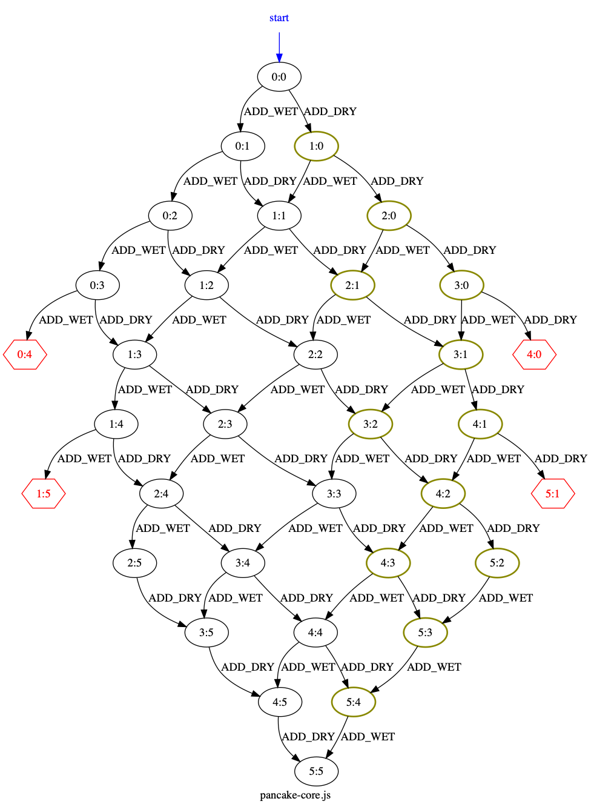

ifndef::env-github[:icons: font]
ifdef::env-github[]
:status:
:outfilesuffix: .adoc
:caution-caption: :fire:
:important-caption: :exclamation:
:note-caption: :page_with_curl:
:tip-caption: :bulb:
:warning-caption: :warning:
endif::[]
= BPjs State Space Mapper

A very simple proof of concept program, that generates a drawing of the transition system of https://github.com/bthink-BGU/bpjs[BPjs] b-programs. Uses http://graphviz.org[Graphviz]. 

Node names are given by a b-thread called `stateTitler`. This b-thread passes the title in its sync statement data field.

[WARNING]
This is a *proof of concept*, will probably not work if there are funky event names, for example. It's also very "engineered" at this point.

.Transition System of a link:WORK/pancake-core.js[b-program]. Nodes with violations are hexagons. Hot nodes have thicker border and are dark yellow.

