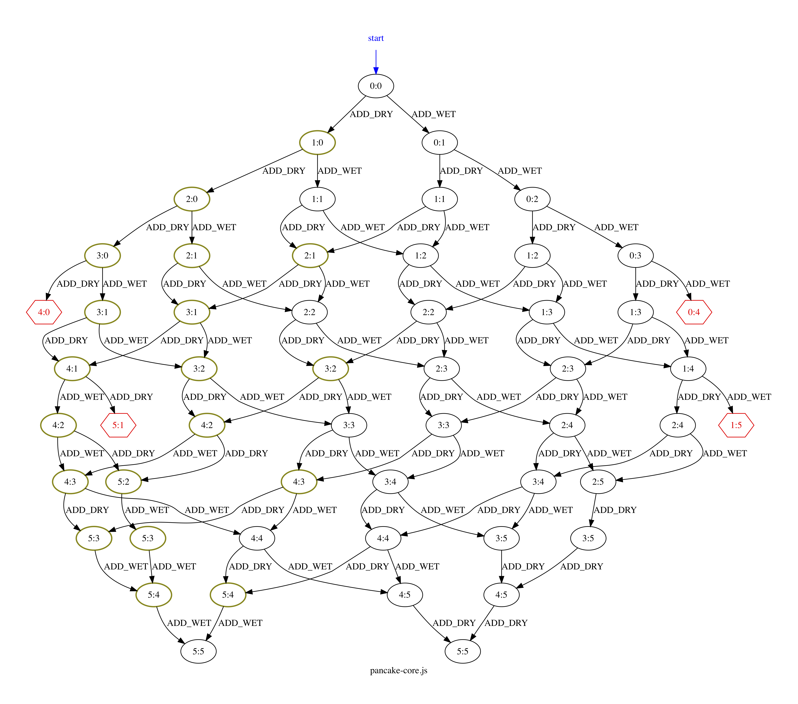

ifndef::env-github[:icons: font]
ifdef::env-github[]
:status:
:outfilesuffix: .adoc
:caution-caption: :fire:
:important-caption: :exclamation:
:note-caption: :page_with_curl:
:tip-caption: :bulb:
:warning-caption: :warning:
endif::[]
= BPjs State Space Mapper

A very simple proof of concept program, that generates a drawing of the transition system of https://github.com/bthink-BGU/bpjs[BPjs] b-programs. Uses http://graphviz.org[Graphviz]. 

Node names are given by a b-thread called `stateTitler`. This b-thread passes the title in its sync statement data field.

[WARNING]
This is a *proof of concept*, will probably not work if there are funky event names, for example. It's also very "engineered" at this point.

[WARNING]
`stateTitler` cannot have state! Not even an implicit one. This is because this state would affect the general b-program state. Future versions will move away from this design.

.Transition System of a link:WORK/pancake-core.js[b-program]. Nodes with violations are hexagons. Hot nodes have thicker border and are dark yellow.

== Usage

Basically, you want to run the main class `statespacemapper.SpaceMapperRunner` and provide it with paths to the source files of the b-program. The program will output a representation of the b-program's state-space/transition system in the *dot* language.

There's also a UNIX shell script in link:dist[the dist directory], you can use like so:

[code, bash]
------
./ssm file1.js file2.js ... filen.js
# or, from source using maven:
mvn exec:java -Dexec.args="file1.js file2.js ..."
------

Normally you'd want to redirect ssm's `stdout` to Graphviz for drawing:

[code, bash]
------
./ssm file1.js file2.js ... filen.js | dot -Tpdf > my-prog.pdf
------

You can also direct it to a file, for manual manipulation:

[code, bash]
------
./ssm file1.js file2.js ... filen.js > my-prog.gv
------

